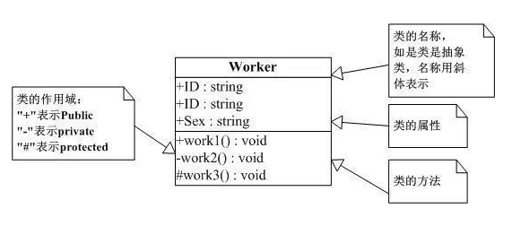
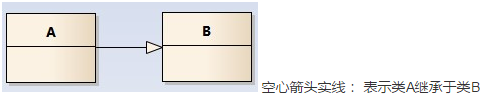
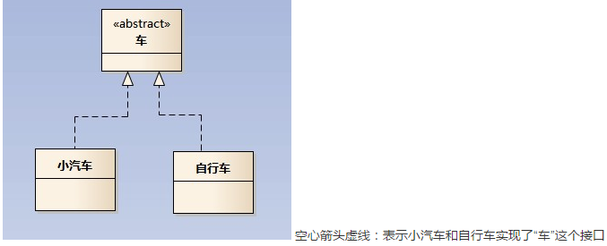
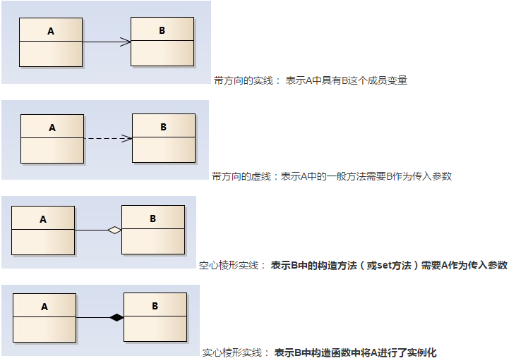

# UML

#####Android UML
1. UML插件一：SimpleUML  
[下载地址](https://plugins.jetbrains.com/plugin/4946?pr=)  
[详解UML图之类图](http://mp.weixin.qq.com/s?__biz=MzIwMTAwOTk1NA==&mid=2247483656&idx=1&sn=1a68f2f7557a842df7ad5a7b0691500c&scene=21#wechat_redirect)  

2. UML插件二：CodeIris 

3. 类图关系  
 * 类（Class)  
 
 * 关系  
 >(泛化(Generalization),实现(Realization),关联(Association),
 聚合(Aggregation),组合(Composition),依赖(Dependency))  
 
  
  
  
      